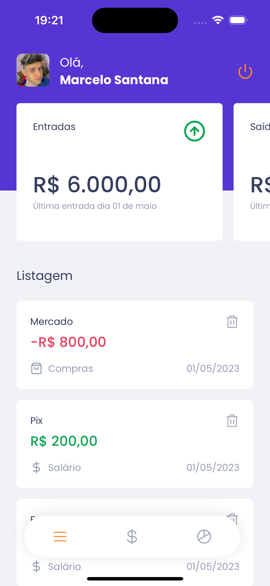

<h1 style="text-align: center; font-weight: bold;">GO Finances App</h1>

<div align="center" >
  
</div>

## Sobre o Projeto

Este projeto consistem em um app para cadastrar e organizar suas finanças de maneira prática e rápida.

### Tecnologias Usadas

- [React Native](https://reactnative.dev/)
- [Expo](https://expo.dev/)
- [TypeScript](https://www.typescriptlang.org/)
- [Styled Components](https://styled-components.com/)
- [Native Base](https://nativebase.io/)
- [React Router](https://reactrouter.com/en/main)
- [React Hook Form](https://react-hook-form.com/)

### Como rodar a aplicação

```bash
# Clone este repositório
$ git clone https://github.com/marrcelosantana/go-finances-app
# Acesse a pasta do projeto
$ cd go-finances-app
# Instale as dependências
$ npm install
# Execute a aplicação em modo de desenvolvimento
$ expo start

```

### Imagens

|                      Login                       |                      Dashboard                      |
| :----------------------------------------------: | :-------------------------------------------------: |
|  |  |

|                      Register                       |                      Summary                      |
| :-------------------------------------------------: | :-----------------------------------------------: |
|  |  |
